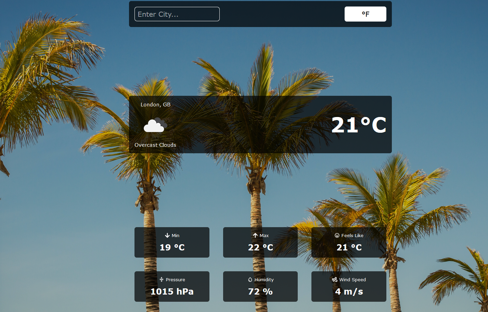

# My City Weather App

**[DEMO LINK](https://mycityweatherapp.netlify.app/)**

The My City Weather App allows users to enter a city in the search bar and receive reliable, live weather information.

For this project, I wanted to practice using some of the React Hooks I have learnt, as well as fetching live data from a 3rd party API.

## Main Learning Points:

- Using `fetch()` to get data from an API
- Reading API docs and understanding how to use them
- Used knowledge learned on the SOC bootcamp to make the app which included asynchronous programming, async, await, `fetch()`, useState and the useEffect hooks.

## Built with:

- React.js
- CSS
- JavaScript
- React Icons
- Open Weather API

## Getting Started:

Clone the repo as instructed below

## Prerequisites:

No prerequisites

## Installation

1.  Clone the repo

`git clone https://github.com/CodeNameMoe/weather-app.git`

2. Run: npm start

## Usage

Enter a city into the search bar and press enter. You can also switch between °F and °C.
